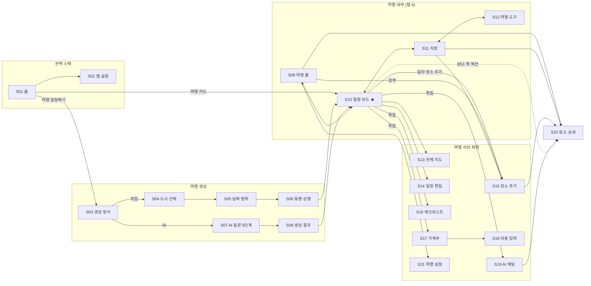
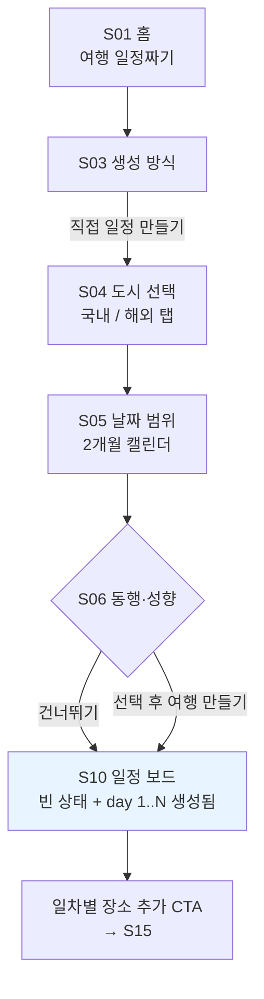
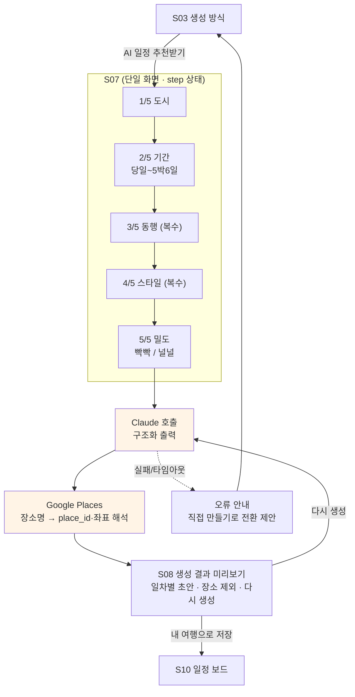
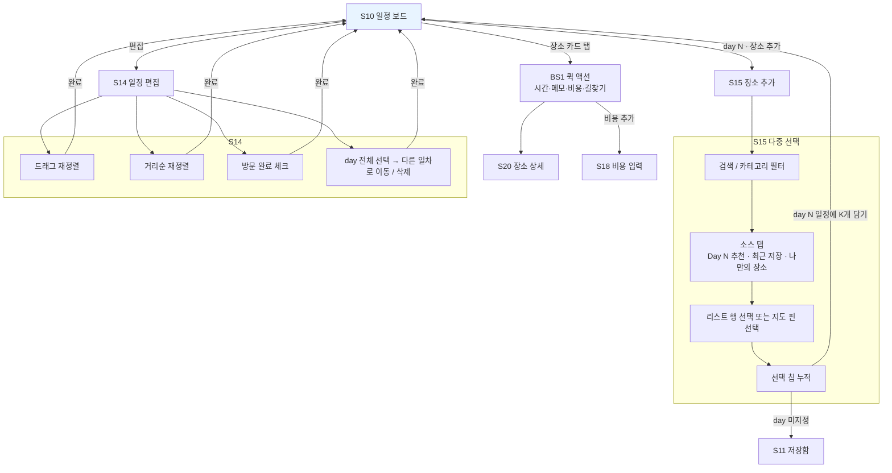
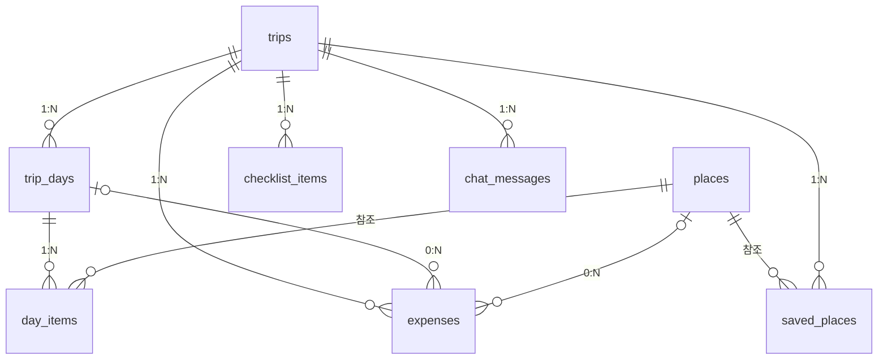

# Itinova 앱 설계서 (와이어프레임 단계)

> 작성일 2026-09-04 · UI/UX 기준: `reference-captures/app-02` (트리플) · 보조: `reference-captures/app-01` (Wanderlog)
> 이 문서는 **기능과 흐름**을 확정한다. 색·타이포·간격·아이콘 등 시각 디자인은 범위 밖이다.
> 렌더 보기(흐름도 포함): https://claude.ai/code/artifact/3b913b65-14c3-4b60-8474-ca978c4afc1f

---

## 1. 제품 정의와 범위

여행 1건을 **계획 → 실행 → 정리**까지 하나의 로컬 앱에서 다루는 여행 일정 도구. 계정 없이 기기 안에서 완결된다.

### 1.1 확정된 전제

| 항목 | 결정 |
| --- | --- |
| 인증 | **없음.** 기기 로컬 SQLite 단독 (`drizzle-orm` + `expo-sqlite`, 이미 세팅) |
| 코어 | 일정 보드 · 일차 편집 · 지도 · 장소 추가 |
| 주변 기능 | 가계부, 체크리스트, 저장(장소 보관함), 여행 도구(날씨·시차·환율·번역) |
| 장소/지도 | Google Places API + `react-native-maps` |
| AI | ① 5단계 질문 기반 일정 생성  ② 여행 맥락 채팅 |
| 국내/해외 | 별도 제품으로 나누지 않음. 도시 선택 단계에서 탭으로만 전환 (트리플 `03`,`04`) |
| 날짜 | **필수.** 날짜 없는 초안 상태를 만들지 않는다 (§3.2 · §4.1) |

### 1.2 제외 항목과 근거

| 제외 | 근거 | 레퍼런스 |
| --- | --- | --- |
| 예약·결제 (항공·숙소·투어·티켓·렌터카) | 제휴/결제 인프라 필요. 앱 가치의 핵심이 아님 | `34`,`40`,`41`, app-01 `66` |
| 커뮤니티 (배낭톡, 동행 모집) | 서버·계정·신고 처리 필수 | `35` |
| 공동 편집·초대 | 계정 없이 불가 | `33` |
| 프로필·쿠폰·포인트·멤버십 | 계정 종속 | `17`, app-01 `71`,`72` |
| 여행기·가이드 작성 | 별도 콘텐츠 제품. 코어와 독립 | app-01 `50`,`69`,`70`,`77` |
| 위치 자동 추적 | 상시 위치 권한 대비 이득이 작음 | app-01 `22`,`40` |

### 1.3 로그인 없음에서 파생되는 제약 (설계에 반영됨)

1. **가계부는 단일 주체 모델.** 지불자·분담 인원 개념 없음. `expenses.split_with` 컬럼만 열어두고 UI에 노출하지 않는다. (트리플 `22`의 "함께한 사람" 제외)
2. **여행 데이터가 기기에만 존재.** JSON 내보내기/가져오기가 유일한 백업·기기 이전 수단 → `trip/[id]/settings`와 `settings`에 배치.
3. **API 키 3종이 클라이언트에 놓인다** (Google Places, Google Maps, Claude). 개발 단계는 `app.config.ts` + `expo-constants` 주입, 배포 전 프록시 필수 → §6 미결 항목.
4. **온보딩 3화면 (2026-09-04 변경).** 원래는 "온보딩 없음 · 첫 실행은 빈 홈 + 단일 CTA"였으나, 계정이 없다는 사실 자체를 사용자에게 알릴 곳이 없다는 문제가 남는다 → §2.0으로 도입. app-01의 10단계 설문형 온보딩은 여전히 채택하지 않는다. 트리플의 성향 입력은 그대로 여행 생성 흐름(S06) 안에서만 받는다.

---

## 2. 화면 인벤토리

전역은 **탭 없는 스택**. 하단 탭은 **여행 내부에서만** 나타난다 (트리플과 동일). 경로가 곧 화면ID이며 `expo-router` 파일 경로다.

### 2.0 온보딩 (첫 실행 1회)

라우트는 **1개**. 세 화면이 제목 + 본문 + CTA로 구조가 같아 `app/onboarding.tsx` 단일 파일 + step 상태로 처리한다 (S07과 같은 방식). 완료 시 `app_settings.onboarded = '1'`, 다음 실행부터 건너뛴다.

| # | 경로 | 화면 | 핵심 요소 | 주요 액션 | 레퍼런스 |
| --- | --- | --- | --- | --- | --- |
| S22 | `/onboarding` | 온보딩 3 step | ① 가치 제안 (3페이지 캐러셀: 일정 보드 · 지도 동선 · AI 초안) ② **로컬 데이터 고지** ③ 위치 권한 사전 안내 | ③ `위치 허용` 또는 `나중에 하기` → S01 | app-01 `11` · `22`(형태만, §7) |

**건너뛰기를 두지 않는다.** app-01은 10단계라 건너뛰기가 필수였지만, 3화면이면 건너뛰기 자체가 불필요하고 ②는 반드시 한 번 보게 해야 한다. 위치만 `나중에`가 있다.

채택하지 않은 것과 근거:

| 제외 | 근거 |
| --- | --- |
| 성향·계획 습관 설문 (app-01 `01`,`02`,`08`) | S06에서 이미 받는다. 성향은 여행마다 달라서 앱 레벨에 한 번 저장하면 오히려 틀린 값이 된다 |
| "다가오는 여행이 있나요?" 분기 (app-01 `12`) | 빈 홈의 단일 CTA가 같은 일을 한다. 화면 하나 값을 못 한다 |
| Pro 체험 제안 (app-01 `13`) | 과금 없음 |
| 프로필·약관 동의 (app-01 `14`) | 계정 없음 |

> **②가 이 온보딩의 존재 이유다.** app-01·app-02 모두 계정이 있어서 "데이터가 이 기기에만 있다"는 말을 할 필요가 없다. Itinova는 그 말을 할 곳이 여기밖에 없고, 안 하면 사용자가 앱을 지울 때 처음 알게 된다. ①③은 관례상 딸려오는 것이고, ②는 §1.3-2의 직접적 결과다.

### 2.1 전역

| # | 경로 | 화면 | 핵심 요소 | 주요 액션 | 레퍼런스 |
| --- | --- | --- | --- | --- | --- |
| S01 | `/` | 홈 | 진행중 여행 카드(D-day·날짜범위), 다가오는/지난 여행 목록, 빈 상태 | 여행 카드 → S10, 하단 고정 `여행 일정짜기` → S03 | `01`,`23` |
| S02 | `/settings` | 앱 설정 | 언어, 날짜·거리 형식, 기본 통화, 위치 권한, 알림, 전체 데이터 내보내기/가져오기 | — | `38`, app-01 `73` |

### 2.2 여행 생성 (모달 스택)

| # | 경로 | 화면 | 핵심 요소 | 주요 액션 | 레퍼런스 |
| --- | --- | --- | --- | --- | --- |
| S03 | `/create` | 생성 방식 | 바텀시트 2행: `직접 일정 만들기` / `AI 일정 추천받기` | → S04 또는 S08 | `02` |
| S04 | `/create/destination` | 도시 선택 | `국내`/`해외` 탭, 검색 입력, 인기 도시 목록, 도시별 보조 텍스트(권역) | 도시 선택 → S05 | `03`,`04` |
| S05 | `/create/dates` | 날짜 범위 | 2개월 세로 스크롤 캘린더, 시작~종료 범위 시각화, 하단 CTA에 `N박 M일` 요약 | → S06 | `05`,`06` |
| S06 | `/create/style` | 동행·성향 | 동행 칩(혼자·친구·연인·가족·아이), 성향 다중 칩(체험·핫플·자연·문화·힐링·쇼핑·먹방), 우상단 `건너뛰기` | `여행 만들기` → S11 | `07`,`08` |

### 2.3 AI 일정 생성

| # | 경로 | 화면 | 핵심 요소 | 주요 액션 | 레퍼런스 |
| --- | --- | --- | --- | --- | --- |
| S07 | `/ai/ask` | AI 질문 5단계 | 단일 화면 + step 상태(1/5~5/5), 진행바, 뒤로. ① 도시 ② 기간(당일~5박6일) ③ 동행(복수) ④ 스타일(복수) ⑤ 밀도(빡빡/널널) | 5단계 완료 → 생성 → S08 | `24`~`29` |
| S08 | `/ai/result` | 생성 결과 미리보기 | 일차별 초안 카드, 장소별 `제외`, `다시 생성`, 생성 근거 1줄, 정확성 고지 | `내 여행으로 저장` → S11 | — (신규) |

> `24-ai-itinerary-intro`(소개 화면)는 별도 화면으로 만들지 않고 S07 1단계 상단 카피로 흡수한다. 화면 하나가 줄고 이탈 지점도 줄어든다.

### 2.4 여행 내부 — 하단 탭 4개

트리플의 5탭에서 `배낭톡`(커뮤니티)만 제거한 구조.

`/trip/[id]/_layout` = **Stack**이고, 탭은 그 안의 `(tabs)` 라우트 그룹에만 있다. 그룹명은 URL에 나타나지 않으므로 경로는 아래 표 그대로다. 이렇게 두는 이유는 두 가지다 — ① 와이어프레임상 S13~S21에는 탭바가 없다(서브 화면은 탭 위로 push되어 탭바를 덮는다) ② expo-router 57에서 탭바에서 화면을 빼는 `href: null`이 타입(`href?: string`)과 맞지 않는다.

| # | 경로 | 탭 | 핵심 요소 | 주요 액션 | 레퍼런스 |
| --- | --- | --- | --- | --- | --- |
| S09 | `/trip/[id]` | **여행 홈** | D-day 헤더(`두근두근, 여행 D-5`), 날짜 칩+편집, 카테고리 탭(`관광`·`맛집`·`숙소`), AI 추천 장소 캐러셀, 검색 아이콘 | 장소 카드 → S20, 검색 → S13, 카테고리 탭 → 리스트 | `30`,`37`,`39` |
| S10 | `/trip/[id]/itinerary` | **일정** ★기준 화면 | 상단 지도 프리뷰(접기/펼치기), 퀵칩 행(`체크리스트`·`가계부`·`AI에게 묻기`), 일차 섹션(`day 1  9.9/수` + 날씨), 순번 배지 장소 카드, **카드 사이 거리 배지(8.1km)**, 일차별 `장소 추가`, 우상단 `편집` | 장소 탭 → BS1, `편집` → S12, 지도 → S11, 퀵칩 → S16/S17/S19 | `09`,`13`, app-01 `63` |
| S11 | `/trip/[id]/saved` | **저장** | `전체`/`관광`/`맛집`/`숙소` 탭, 장소 카드, 빈 상태 안내 | 카드 → S20, 카드 액션 `일정에 추가` → BS3 | `36` |
| S12 | `/trip/[id]/tools` | **여행 도구** | 수직 섹션: 날씨(여행 날짜 기준 일별 예보) · 시차(현지↔한국) · 환율(통화쌍·기준 시각) · 번역(입력/대상 언어) | — | `18`,`19`,`20` |

### 2.5 여행 내부 — 서브 화면

| # | 경로 | 화면 | 핵심 요소 | 주요 액션 | 레퍼런스 |
| --- | --- | --- | --- | --- | --- |
| S13 | `/trip/[id]/map` | 전체 지도 | `전체`/`day 1`~`day N` 필터 칩, 순번 핀, 일차 경로 점선, 장소 없는 상태 | 핀 탭 → BS1 | `10`,`14` |
| S14 | `/trip/[id]/edit` | 일정 편집 | 상단 지도(순번·경로), 드래그 핸들, `거리순 재정렬`, 방문 완료 체크, `day 전체 선택`(다른 일차로 이동/삭제), 우상단 `완료` | 완료 → S10 | `14` |
| S15 | `/trip/[id]/add-place?day=N` | 장소 추가 | 상단 지도 + 검색바(`관광지/맛집/숙소 검색`), 카테고리 필터 칩(`맛집`·`관광`·`숙소`), 하단 시트 소스 탭(`Day N 추천`·`최근 저장`·`나만의 장소`), 리스트 행 `선택` 토글, 지도 핀 선택, 하단 `day N 일정에 N개 담기` | 담기 → S10 / `day` 없으면 저장함(S11)으로 | `11`,`12`,`39`, app-01 `62` |
| S16 | `/trip/[id]/checklist` | 체크리스트 | 카테고리 섹션(`필수 준비물`·`기본 짐싸기`) 기본 템플릿, 완료 토글, 항목 추가, 항목·카테고리 더보기 메뉴 | — | `31`,`32` |
| S17 | `/trip/[id]/budget` | 가계부 | 통화별 합계 헤더, 일차별/카테고리별 토글 목록, 항목 행(항목명·카테고리·금액), 하단 `비용 추가` | → S18 | `21`, app-01 `38` |
| S18 | `/trip/[id]/expense/new` | 비용 입력 | 통화, 금액, 일차 선택, 결제수단, 항목명, 카테고리, (선택) 연결 장소 | 저장 → S17 | `21`,`22`, app-01 `76` |
| S19 | `/trip/[id]/chat` | AI 채팅 | 여행 컨텍스트 배지(`부산 · 9.9–9.11 · 친구와`), 추천 질문 칩, 메시지 목록, 응답 내 장소 카드 → `일정에 담기`, 하단 정확성 고지 | 장소 담기 → BS3 | app-01 `58` |
| S21 | `/trip/[id]/settings` | 여행 설정 | 제목, 날짜, 동행·성향, 기본 통화, JSON 내보내기, 맨 아래 분리된 `여행 삭제` | — | app-01 `46`,`47` |

### 2.6 공용

| # | 경로 | 화면 | 핵심 요소 | 주요 액션 | 레퍼런스 |
| --- | --- | --- | --- | --- | --- |
| S20 | `/place/[placeId]` | 장소 상세 | 사진, 평점·리뷰 수, 카테고리·지역, 소개, 주소·전화·영업시간, 지도 미니맵 | `저장`, `일정에 추가` → BS3, `길찾기`(외부 앱) | `16`, app-01 `65` |

### 2.7 바텀시트 (라우트 아님)

| ID | 시트 | 요소 | 레퍼런스 |
| --- | --- | --- | --- |
| BS1 | 장소 퀵 액션 | 장소명·카테고리, `>` 상세 진입, `시간 추가`, `메모 추가`, `비용 추가` / `길찾기` | `15` |
| BS2 | 생성 방식 | S03이 이 형태 | `02` |
| BS3 | 일차 선택 | `day 1`~`day N` + `저장함에만 담기` | — |

**총 화면 22개 + 여행 탭 레이아웃 1개 + 바텀시트 3개 + 코치마크 4곳(5스텝) + 빈 상태 4개.**
와이어프레임 아트보드 35개.

### 2.8 라우트 트리

```
app/
├── _layout.tsx                    Stack
├── index.tsx                      S01 홈
├── onboarding.tsx                 S22 온보딩 (step 1~3)
├── settings.tsx                   S02 앱 설정
├── create/
│   ├── _layout.tsx                Stack (루트에서 presentation: modal)
│   ├── index.tsx                  S03 생성 방식
│   ├── destination.tsx            S04
│   ├── dates.tsx                  S05
│   └── style.tsx                  S06
├── ai/
│   ├── ask.tsx                    S07
│   └── result.tsx                 S08
├── place/
│   └── [placeId].tsx              S20
└── trip/
    └── [id]/
        ├── _layout.tsx            Stack
        ├── (tabs)/
        │   ├── _layout.tsx        Tabs (여행 홈·일정·저장·도구)
        │   ├── index.tsx          S09
        │   ├── itinerary.tsx      S10
        │   ├── saved.tsx          S11
        │   └── tools.tsx          S12
        ├── map.tsx                S13
        ├── edit.tsx               S14
        ├── add-place.tsx          S15
        ├── checklist.tsx          S16
        ├── budget.tsx             S17
        ├── chat.tsx               S19
        ├── settings.tsx           S21
        └── expense/
            └── new.tsx            S18
```

### 2.9 화면 안내 — 빈 상태와 코치마크

레퍼런스에는 세 가지가 섞여 있다. 구분해서 쓴다.

| 종류 | 정체 | 지속 | 닫기 | 레퍼런스 |
| --- | --- | --- | --- | --- |
| **빈 상태** | 화면 본문 그 자체 | 데이터 없으면 상시 | 없음 | app-02 `36`, app-01 `32`,`38`,`40` |
| **코치마크** | 화면 위 딤 오버레이 | 첫 진입 1회 | 닫으면 끝 | app-01 `60` |
| 팁 카드 · 설정 체크리스트 | 상시 잔류하는 안내 블록 | 상시 | 숨기기 | app-01 `59`,`74` |

**원칙: 빈 상태로 설명되는 것에는 코치마크를 만들지 않는다.**

빈 상태는 공짜다. 화면이 이미 비어 있으니 그 공간에 안내를 넣으면 되고, 딤도 닫기도 필요 없고, 다시 봐도 된다. 코치마크는 비싸다. 화면을 가리고, 사용자가 닫아야 하고, 한 번 놓치면 다시 볼 방법이 없다. 그래서 코치마크는 **화면에 내용이 이미 차 있는데 조작 방법이 안 보이는 경우**에만 쓴다.

세 번째 종류(팁 카드·설정 체크리스트)는 채택하지 않는다. app-01 `59`,`60`,`74` 캡처가 그 이유를 그대로 보여준다 — 팁 카드가 FAB를 덮고, 코치마크가 헤더를 덮고, `12 중 3` 설정 체크리스트가 실제 콘텐츠 위를 상시 차지하다 `단계 숨기기`를 따로 달아야 했다.

#### 코치마크 — 4곳 5스텝

**선정 기준: 놓치면 그 화면의 핵심 가치를 잃는 조작만.** 놓쳐도 화면을 쓸 수 있는 부가 조작은 만들지 않는다. 이 선을 안 그으면 화면마다 하나씩 붙어서 app-01 `59`,`74`가 된다.

`app_settings`에 1회 노출 플래그를 둔다 (스키마 변경 없음).

| # | 대상 화면 | 스포트라이트 | 트리거 | 내용 | 플래그 |
| --- | --- | --- | --- | --- | --- |
| C01 | S10 일정 보드 | 순번 1 장소 카드 | **첫 장소를 담은 직후** | 카드 탭 → BS1 퀵 액션 · 카드 사이 숫자는 직선거리 | `tip_itinerary` |
| C02 | S14 일정 편집 1/2 | day 1 장소 목록 (핸들) | 첫 진입 | 핸들 드래그 / `거리순 재정렬` 두 가지로 순서를 바꾼다 | `tip_edit` |
| C03 | S14 일정 편집 2/2 | 하단 액션바 | C02에서 `다음 팁` | 체크 또는 `day 전체 선택` 후 다른 일차로 이동 / 삭제 | `tip_edit` |
| C04 | S13 전체 지도 | 일차 필터 칩 행 | 첫 진입 | 일차를 고르면 그 날의 핀·경로만 · 핀 탭 → 퀵 액션 | `tip_map` |
| C05 | S08 AI 생성 결과 | day 1 초안 목록 | 첫 진입 | 저장 전에 다듬는 화면 — `제외`로 빼고 `다시 생성`으로 재시도 | `tip_ai_result` |

근거:

- **C01** — 담기 **전**이 아니라 담은 **직후**다. 담기 전은 E02(일차 골격 + 점선 `장소 추가`)가 이미 다음 행동을 하나로 좁혀 놨다. 카드가 생긴 뒤에야 "카드를 탭하면 뭐가 되는지"가 화면에서 사라진다.
- **C02·C03** — 편집 화면에 기능이 셋(순서 변경 · 일차 이동/삭제 · 방문 체크)인데 어느 것도 화면에 드러나지 않는다. 그래서 유일하게 2스텝 체인 (app-01 `60`의 `다음 팁` 형태).
- **C04** — 놓치면 핀 20개가 겹쳐 지도가 무용해진다. app-01 `60`이 정확히 같은 문제를 같은 방식으로 푼다.
- **C05** — 놓치면 AI 초안을 손대지 못하고 그대로 저장한다. `제외`가 작은 행 버튼이고 `다시 생성`은 헤더에 있어 "다듬는 화면"이라는 성격이 안 읽힌다.

두지 않는 화면과 근거:

| 화면 | 근거 |
| --- | --- |
| S15 장소 추가 | 지도 핀 선택은 못 찾아도 리스트로 다 된다 = 부가. 리스트 `선택` 토글과 하단 CTA 개수가 조작을 이미 드러낸다 |
| S16 체크리스트 | 기본 템플릿이 시드되어 화면이 이미 채워져 있고, 기본 항목 수정은 부가 |
| S05 날짜 범위 | "시작일 → 종료일 차례로"는 핵심이지만, 딤으로 캘린더를 가리면 방해가 된다 → 캘린더 위 **인라인 힌트 한 줄**로 처리 |
| S06 · S07 복수 선택 | 인라인 `복수 선택` 라벨로 처리 |
| S09 · S11 · S12 · S17 · S19 | 빈 상태 또는 자기설명적 |

#### 코치마크 구현 메모

말풍선은 대상 요소를 감싸는 래퍼(`position:relative`, 딤보다 높은 `z-index`) **안에서** `position:absolute`로 위(`bottom:100%`) 또는 아래(`top:100%`)에 붙인다. 좌표 상수를 쓰지 않으므로 위아래 콘텐츠가 바뀌어도 앵커가 어긋나지 않는다. 스포트라이트는 대상에 흰 배경 + 링(`box-shadow: 0 0 0 4px`).

#### 빈 상태 4개

| # | 화면 | 내용 |
| --- | --- | --- |
| E01 | S01 홈 | `아직 여행이 없어요` + 하단 단일 CTA. 온보딩 직후 첫 화면 |
| E02 | S10 일정 보드 | 일차 골격은 그대로 두고 각 일차에 점선 `장소 추가`만. **별도 안내 문구를 넣지 않는다** — 점선 버튼이 곧 다음 행동이다 |
| E03 | S11 저장 | `저장한 장소가 없어요`. 탭 라벨에 개수 0 표시 (app-02 `36`). CTA 없음 |
| E04 | S17 가계부 | 합계 0 + `기록한 비용이 없어요` + 하단 `비용 추가` |

S13의 빈 상태는 지도가 화면을 채우므로 지도 중앙 안내 카드 하나로 처리한다 (§2.5 참조, 별도 아트보드 없음).

---

## 3. 화면 흐름 (머메이드)

### 3.1 전체 네비게이션 그래프



### 3.2 직접 생성 플로우



> **날짜는 필수.** app-01은 날짜 없는 초안을 허용하지만, 날짜가 없으면 일차·날씨·거리 계산이 전부 성립하지 않는다. Itinova는 날짜를 필수로 두고 초안 상태를 만들지 않는다.

### 3.3 AI 일정 생성 플로우



> LLM이 반환한 좌표는 신뢰하지 않는다. **장소명·도시만 받아 Google Places Text Search로 실제 `place_id`와 좌표를 확정**하고, 해석 실패한 장소는 결과 화면에서 조용히 제외한다. (§5.1)

### 3.4 장소 추가·편집 루프



---

## 4. 데이터 모델

로컬 SQLite 단독. 모든 시간은 UTC ISO 문자열, 날짜는 `YYYY-MM-DD` 문자열로 저장한다 (SQLite에 날짜 타입이 없고, 여행 날짜는 타임존 변환 대상이 아니라 "현지 달력상의 날"이다).



| 테이블 | 컬럼 | 비고 |
| --- | --- | --- |
| `trips` | `id`, `title`, `city_name`, `city_place_id`, `country_code`, `lat`, `lng`, `start_date`, `end_date`, `companion`, `styles`(JSON 배열), `pace`, `currency`, `origin`(`manual`\|`ai`), `created_at` | `title` 기본값 = `{도시} 여행` |
| `trip_days` | `id`, `trip_id`, `day_index`(1-based), `date`, `title` | 여행 생성 시 날짜 범위로 일괄 생성. 날짜 변경 시 재생성 |
| `day_items` | `id`, `trip_day_id`, `place_id`, `sort_order`, `start_time`, `memo`, `visited` | `sort_order`는 정수 간격 배치. 재정렬은 이 값만 갱신 |
| `places` | `id`, `google_place_id`(unique), `name`, `category`, `address`, `region`, `lat`, `lng`, `rating`, `rating_count`, `photo_url`, `opening_hours`(JSON), `summary`, `is_custom`, `fetched_at` | **Google Places 응답 캐시.** 오프라인 조회와 API 호출 절감이 목적. `is_custom`=사용자가 직접 만든 "나만의 장소" |
| `saved_places` | `id`, `trip_id`, `place_id`, `created_at` | 여행별 보관함 (`36`은 전역 목록이 아니라 여행 맥락) |
| `expenses` | `id`, `trip_id`, `trip_day_id`, `place_id`, `title`, `category`, `currency`, `amount`, `payment_method`, `split_with`, `created_at` | `split_with`은 스키마에만 존재, UI 미노출 (§1.3-1) |
| `checklist_items` | `id`, `trip_id`, `category`, `label`, `done`, `sort_order` | 여행 생성 시 기본 템플릿 시드 |
| `chat_messages` | `id`, `trip_id`, `role`, `content`, `created_at` | 여행별 대화. 컨텍스트 구성은 §5.2 |
| `app_settings` | `key`, `value` | 단일 행 KV. 언어·단위·기본 통화 |

파생값은 저장하지 않는다:

- **장소 간 거리**는 `day_items` 순서 + `places.lat/lng`로 **Haversine 직선거리를 렌더 시 계산**한다. 트리플도 직선거리(`8.1km`)를 표시한다. `// ponytail: 직선거리. 실제 이동시간이 필요해지면 Distance Matrix로 교체하고 결과만 캐시`
- **D-day**는 `start_date` - 오늘.

### 4.1 여행 날짜 변경 규칙 (S21)

날짜를 필수로 둔 대가는 여기서 치른다. S21에서 날짜를 바꾸면 `trip_days`를 재생성해야 하고, 일차가 줄어들면 담아둔 장소의 갈 곳이 필요하다.

| 변경 | `trip_days` | `day_items` |
| --- | --- | --- |
| 기간 동일, 날짜만 이동 (9.9~9.11 → 9.16~9.18) | `date`만 갱신, `day_index` 유지 | 그대로 |
| 기간 증가 (3일 → 5일) | 뒤에 빈 일차 추가 | 그대로 |
| **기간 감소 (3일 → 2일)** | 초과 일차 삭제 | **사라지는 일차의 장소를 `saved_places`로 이동**한 뒤 삭제 |

- 감소 시 저장 전 확인 1회: "day 3의 장소 2개가 저장함으로 이동합니다."
- `expenses.trip_day_id`는 `ON DELETE SET NULL` — 비용 기록은 일차가 사라져도 여행에 남는다. 가계부 `일차별` 탭에서는 `미지정` 그룹으로 묶는다.
- 이동 대상이 이미 저장함에 있으면 중복 삽입하지 않는다 (`saved_places`의 `(trip_id, place_id)` unique).

---

## 5. AI 연동 명세

모델은 `claude-sonnet-5`. 두 기능 모두 **여행 컨텍스트에 묶인** 기능이며, 범용 챗봇 진입점은 만들지 않는다 (트리플·Wanderlog 모두 동일한 판단).

### 5.1 일정 생성 (S07 → S08)

**입력** — S07 5단계 결과:

```
{ city: string, nights: 0..5, companions: string[], styles: string[], pace: "packed" | "relaxed" }
```

**출력** — tool use로 강제하는 구조:

```
{ days: [ { day_index: number, items: [ { name: string, category: "attraction"|"food"|"cafe"|"stay", search_query: string, reason: string } ] } ] }
```

**후처리 (중요)**

1. 각 `search_query`를 Google Places Text Search로 조회해 `place_id`·좌표·카테고리를 확정하고 `places`에 캐시한다.
2. 좌표·영업시간·평점은 **Places 응답만** 신뢰한다. LLM 출력의 좌표는 받지 않는다.
3. 해석 실패한 항목은 S08에서 제외하고, 일차별 장소 수가 기준(밀도 `packed` 4~5, `relaxed` 2~3) 미달이면 사용자에게 `다시 생성`을 권한다.
4. `내 여행으로 저장` 시점에 `trips`·`trip_days`·`day_items`를 트랜잭션으로 적재한다. 저장 전까지는 DB에 쓰지 않는다.

### 5.2 여행 맥락 채팅 (S19)

**시스템 컨텍스트** = 여행 요약 + 현재 일정 요약:

```
도시: 부산 / 기간: 2026-09-09~2026-09-11 (2박 3일) / 동행: 친구와 / 성향: 먹방, 핫플 / 밀도: 널널
현재 일정:
  day 1 (9/9): 부산역, 광안리 해수욕장
  day 2 (9/10): (없음)
  day 3 (9/11): (없음)
```

- 직전 8턴만 함께 보낸다. 그 이상은 잘라낸다. `// ponytail: 고정 윈도우. 요약 압축은 대화가 실제로 길어질 때`
- 추천 질문 칩은 일정 상태에 따라 정적으로 분기: 빈 일차가 있으면 "day 2 뭐 넣을까?", 다 찼으면 "동선 좀 봐줄래?"
- 응답에 장소명이 포함되면 Places로 해석해 카드로 렌더하고 `일정에 담기`(BS3)를 붙인다. 해석 실패 시 일반 텍스트로 둔다.
- 하단 정확성 고지 상시 노출 (영업시간·가격은 확인 필요).

---

## 6. 외부 의존성과 미결 항목

| 항목 | 현재 결정 | 미결/후속 |
| --- | --- | --- |
| **API 키 관리** | 개발: `app.config.ts` + `expo-constants`로 주입, `.env`는 gitignore | ⚠️ **배포 차단 항목.** 클라이언트 번들의 키는 추출 가능하다. Claude 키는 반드시 얇은 프록시(Cloudflare Workers 등) 뒤로 옮긴다. Google Maps/Places 키는 번들ID·API·리퍼러 제한을 건다 |
| Google Places | Text Search + Place Details. 응답은 `places` 테이블에 캐시 | 캐시 TTL, 월 쿼터 상한 시 폴백(캐시 전용 모드) |
| `react-native-maps` | Expo 57 config plugin 방식. Expo Go 불가 → dev client 필요 | 첫 구현 전 `npx expo install react-native-maps` + prebuild 확인 |
| 거리 표시 | Haversine 직선거리 | 이동시간·교통수단이 필요해지면 Distance Matrix |
| 날씨 | 여행 도시·날짜 기준 일별 예보. 무료 API 1개 선정 필요 (Open-Meteo 후보 — 키 없음) | 미선정 |
| 환율 | 기준 시각 표시 필수. 무료 API 1개 선정 필요 | 미선정 |
| 번역 | 별도 API 필요. **Claude로 처리해 의존성 1개를 줄이는 안을 우선 검토** | 미결 |
| 오프라인 | `places` 캐시 덕에 일정·지도 핀·상세는 조회 가능. 검색·AI·날씨·환율은 불가 → 빈 상태에 "오프라인" 안내 | 지도 타일 오프라인 캐시는 범위 밖 |
| 시각 디자인 | 범위 밖 | 와이어프레임 승인 후 별도 |

---

## 7. 레퍼런스 캡처 매핑 (누락 검증)

`reference-captures/app-02` 41개 캡처 전수 대조. **미매핑 0건.**

| 캡처 | 처리 |
| --- | --- |
| `01`,`23` | S01 |
| `02` | S03 / BS2 |
| `03`,`04` | S04 |
| `05`,`06` | S05 |
| `07`,`08` | S06 |
| `09`,`13` | S10 |
| `10` | S13 |
| `11`,`12` | S15 |
| `14` | S14 (+ S13 경로 표현) |
| `15` | BS1 |
| `16` | S20 |
| `17` | **부분 흡수** — `현재 여행`·`내 여행`은 S01, 설정은 S02. 예약·쿠폰·포인트·리뷰·여행기는 §1.2 제외 |
| `18`,`19`,`20` | S12 |
| `21`,`22` | S18 (`함께한 사람` 제외) |
| `24` | **흡수** — S07 1단계 상단 카피 |
| `25`~`29` | S07 |
| `30`,`37` | S09 (예약 탭 `항공`·`숙소`·`투어·티켓`·`라운지` 제외, `관광`·`맛집`·`숙소` 탐색만) |
| `31`,`32` | S16 |
| `33` | 제외 (공동 편집) |
| `34` | 제외 (예약) |
| `35` | 제외 (커뮤니티) |
| `36` | S11 |
| `38` | S02 |
| `39` | **흡수** — S15의 검색바가 통합 검색 진입점 역할 (별도 화면 만들지 않음) |
| `40`,`41` | 제외 (예약) |

app-01(Wanderlog)에서 차용한 것: `58` AI 어시스턴트 → S19, `63`/`65` 장소 간 이동 제약·인라인 편집 → S10/BS1, `46`/`47` 여행 수준 설정·통화·내보내기 → S21, `76` 비용 폼 → S18, `73` 표시 설정 → S02.
채택하지 않은 것:

| 제외 | 캡처 | 비고 |
| --- | --- | --- |
| 설문형 긴 온보딩 | `01`~`08`, `12`~`14` | 가치 제안 `11`만 §2.0 O01로 채택 |
| 위치 자동 추적 | `22` | 기능 자체는 §1.2에서 제외. **권한 요청에 `나중에`를 명확히 두는 형태만** §2.0 O03에 차용 |
| 상시 팁 카드 · 여행 완성도 체크리스트 | `59`, `74` | 콘텐츠를 상시 가린다. 1회성 코치마크 형태 `60`(`다음 팁` 체인 포함)만 §2.9로 채택 |
| 날짜 없는 초안 | `32` | §1.1 · §3.2 |
| 여행기 · 가이드 | `50`,`69`,`70`,`77` | §1.2 |

---

## 8. 다음 단계

1. ~~화면 인벤토리 + 데이터 모델 + 흐름도~~ (이 문서)
2. ~~와이어프레임 캔버스 — 35아트보드, 회색 박스 + 라벨만~~
   - 캔버스: https://claude.ai/code/artifact/df0759f4-5614-4c3b-a123-bf4562c22317
   - 작업 파일: `docs/wireframes/build.mjs` (`.dc.html` 35개를 여기서 생성). 수정은 이 파일에서 하고 `node build.mjs` → 재발행
3. ~~`db/schema.ts` 작성 → `npm run db:generate`~~ — 9테이블, `drizzle/20260904083241_fancy_songbird`
4. ~~라우트 골격~~ — 화면 22 + 레이아웃 4 (`app/_layout` · `create/_layout` · `trip/[id]/_layout` · `trip/[id]/(tabs)/_layout`) + 임시 껍데기 `components/Screen.tsx`
   - 골격 단계는 네이티브 헤더를 켜둔다 (뒤로가기·타이틀이 공짜). 5단계에서 화면별로 끈다
   - `expo-router` 57 주의: `Tabs`를 `'expo-router'`에서 import하면 deprecated → `'expo-router/js-tabs'`
   - 마이그레이션 실행(`useMigrations`)은 아직 붙이지 않았다. DB를 읽는 첫 화면에서 넣는다
5. S10 일정 보드부터 구현. 시각은 `docs/design-system.md` 토큰 적용. 구현하는 파일에서 `Screen` 껍데기를 걷어낸다
