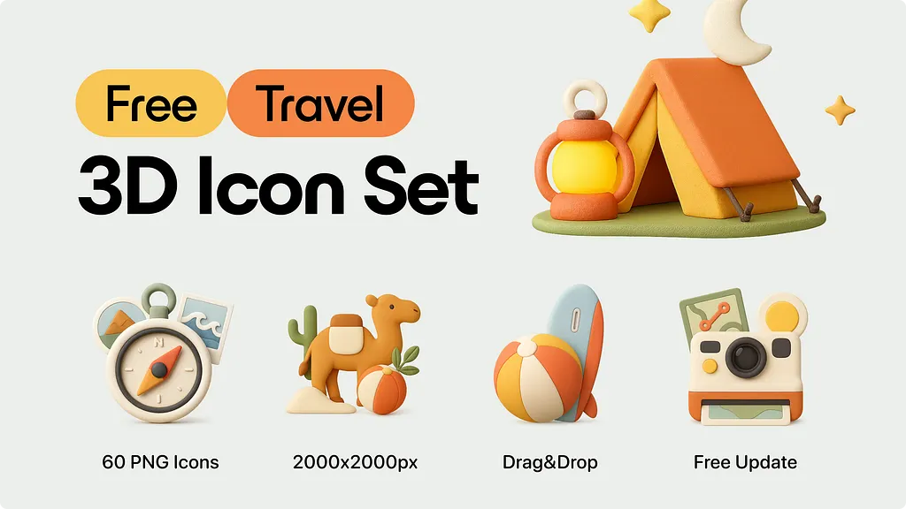
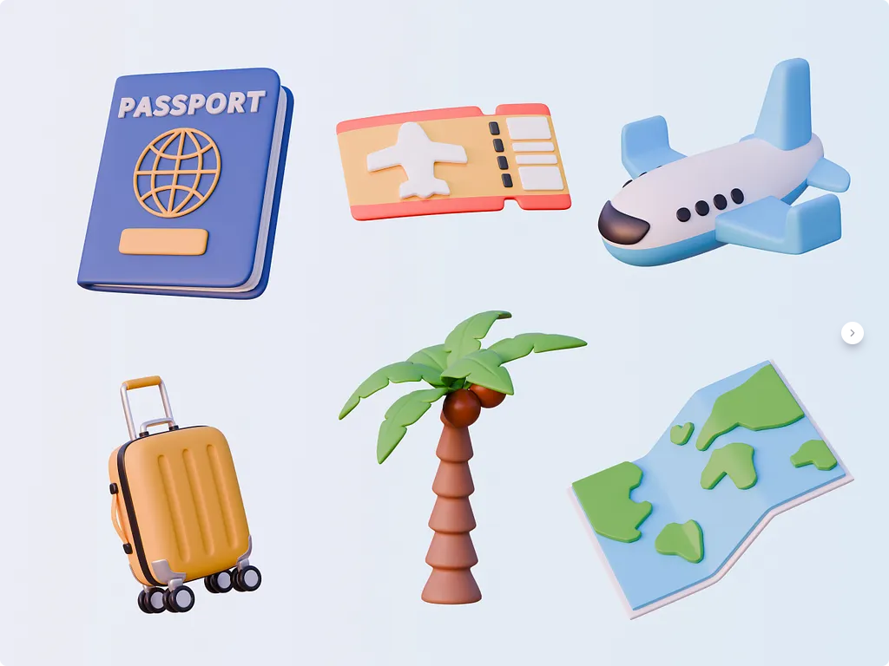
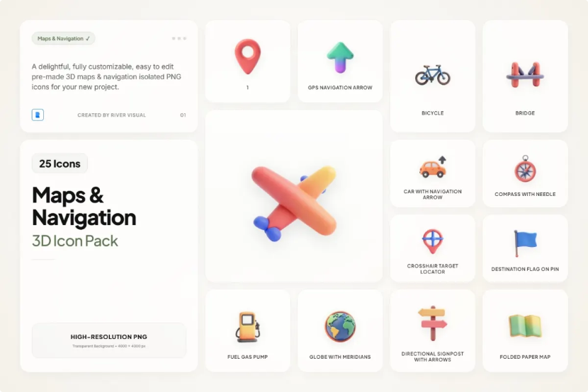
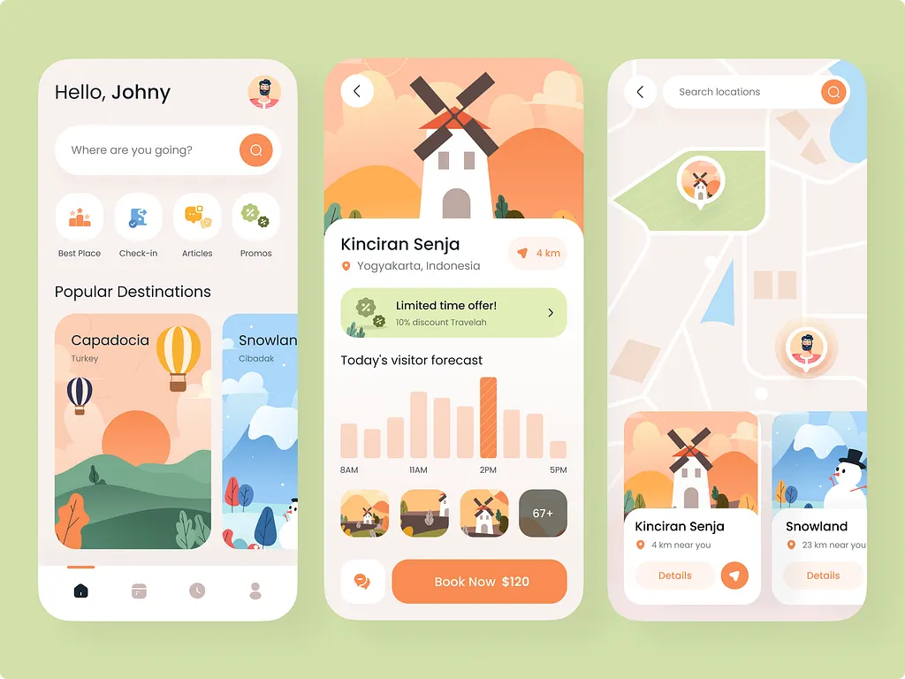
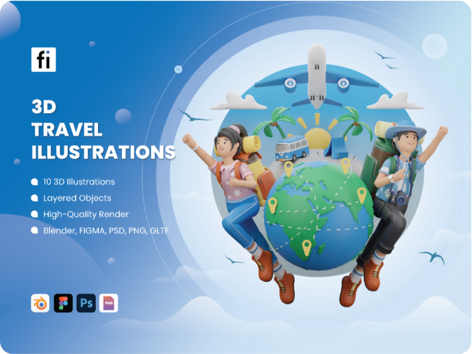
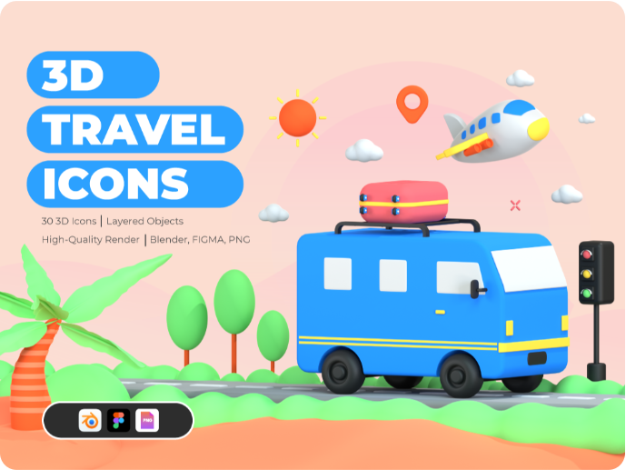

# 여행 × 3D 클레이 레퍼런스

웹 조사 및 캡처: 2026-09-16. 앱 적용 전 검토 자료입니다.

## 먼저 볼 자료

**01 Roam → 03 Map Clay → 06 Travel UI** 순서로 보면 소품 질감, 지도 표현, 화면 구성을 비교할 수 있습니다. 아래 적용 포인트는 원문 스크린샷을 바탕으로 정리한 제안입니다.

| 번호 | 레퍼런스 / 원문 출처 | 검토 포인트 | 연결할 화면 |
| --- | --- | --- | --- |
| 01 | [Roam — Tran Mau Tri Tam](https://dribbble.com/shots/26389574-Roam-Travel-3D-Icon-Set) | 무광 표면, 둥근 모서리, 크림·오렌지·올리브 소품. 여행과 클레이를 함께 보여주는 핵심 후보 | 홈 여행 카드, 온보딩, 체크리스트 빈 상태 |
| 02 | [Travel Concept — Ketrin L.](https://dribbble.com/shots/27350184-Travel-Concept-3D-Icons) | 여권·티켓·비행기·지도·캐리어의 파스텔 색과 둥근 형태 | 여행 도구, 카테고리 |
| 03 | [Map & Navigation Claymorphic — River Visual / Pixelbuddha](https://pixelbuddha.net/icons/12120-map-navigation-claymorphic-3d-icons) | 통통한 핀, 접힌 지도, 비행기, 표지판의 단순한 형태와 부드러운 그림자 | 지도 안내, 장소 검색 빈 상태, 여행 생성 |
| 05 | [3D Summer Travel — SketchValley](https://sketchvalley.com/collections/3d-summer-travel-icons-pack/) | 밝은 여름 소품. 매끈한 광택이 있어 무광 클레이와 차이를 비교 | 여행 준비, 체크리스트 |
| 06 | [Travel App Exploration — Paperpillar](https://dribbble.com/shots/23394386-Travel-App-Exploration) | 크림 화면, 큰 라운드 카드, 일러스트 여행지, 지도 위 카드. 2D 일러스트 기반으로 화면 구성 참고 | 여행 홈, 장소 상세, 지도 |
| 07 | [3D Travel Illustration Set — Flat Icons](https://flat-icons.com/downloads/3d-travel-illustration-set/) | 인물·지구·비행기를 함께 배치한 장면 구성. 작은 아이콘보다 큰 일러스트 용도 | 온보딩, 여행 생성 완료 |
| 09 | [3D Travel Icon Set — Flat Icons](https://flat-icons.com/downloads/3d-travel-icon-set/) | 여행 소품 세트의 통일성과 개별 실루엣 비교 | 도구, 준비물, 빈 상태 |

## 스크린샷 보기

`screenshots/`의 `*-page.png`는 출처 페이지 캡처, `*-detail.png`는 해당 페이지의 주요 이미지 요소를 캡처한 파일입니다. 상세 캡처는 사이트 이미지가 정상 로딩된 경우에만 있습니다. 원본 상품 파일은 내려받지 않았습니다. 05 Summer Travel은 일부 소품이 부분 로딩되어 페이지 캡처만 보관했습니다.

- [01 Roam 페이지](screenshots/01-roam-page.png)
- [02 Travel Concept 페이지](screenshots/02-travel-concept-page.png)
- [03 Map Clay 페이지](screenshots/03-map-clay-page.png)
- [05 Summer Travel 페이지](screenshots/05-summer-travel-page.png)
- [06 Travel UI 페이지](screenshots/06-travel-ui-page.png)
- [07 Travel Scenes 페이지](screenshots/07-travel-scenes-page.png)
- [09 Travel Icon Set 페이지](screenshots/09-travel-icon-set-page.png)

## 현재 프로젝트와 맞춰 볼 기준

기존 `docs/design-system.md`는 이미 클레이 방향을 정의하고 있습니다. 크림 캔버스 `#fffaf0`, 잉크 `#0a0a0a`, 크림 카드 `#f5f0e0` 위에 여행 소품을 얹는 방향이 자연스럽습니다. 소품의 포인트 색은 기존 peach `#ffb084`, ochre `#e8b94a`, mint `#a4d4c5`, lavender `#b8a4ed` 토큰과 맞춰 검토하면 좋겠습니다.

검토할 항목:

2026-09-16 결정: 무광 클레이·소품만·대형 160/240dp·소형 44/48/56dp·소형 무그림자. [완료 리뷰](../../reviews/2026-09-16-11-clay-assets-and-visual-refresh.md), [생성 기록](../../../assets/clay/README.md).

- 무광에 작은 표면 질감이 있는 클레이와 매끈한 장난감 같은 3D 중 선호하는 쪽
- 인물 캐릭터를 쓸지, 캐리어·지도·비행기 같은 소품 중심으로 갈지
- 큰 일러스트를 온보딩·빈 상태에 집중할지, 홈 카드에도 사용할지

## 캡처 제한 및 출처 기록

- [04 ilcons 3D Clay Icons](https://getillustrations.com/illustration-pack/ilcons-3d-icons): 보안 확인 화면으로 캡처가 막혀 링크만 보관했습니다.
- [08 Icons8 Travel 3D Fluency](https://icons8.com/icons/set/travel/3d-fluency): 보안 확인 화면으로 캡처가 막혀 링크만 보관했습니다.
- `capture-log.json`에 URL, 캡처 시각, 로딩/차단 상태가 있습니다. 번호가 비는 것은 위 차단 자료 때문입니다.

스크린샷은 레퍼런스 검토용이며, 실제 자산 도입 시에는 선택한 제공처의 라이선스를 확인합니다. 앱 코드와 디자인 토큰은 변경하지 않았습니다.

## 주요 이미지 바로 보기

### 01 Roam: Travel 3D Icon Set by Tran Mau Tri Tam ✪ on Dribbble

### 02 Travel Concept 3D Icons by Ketrin L. on Dribbble

### 03 Map & Navigation Claymorphic 3D Icons

### 06 Travel App Exploration by Paperpillar on Dribbble

### 07 3D Travel Illustration Set - Flat Icons

### 09 3D Travel Icon Set

