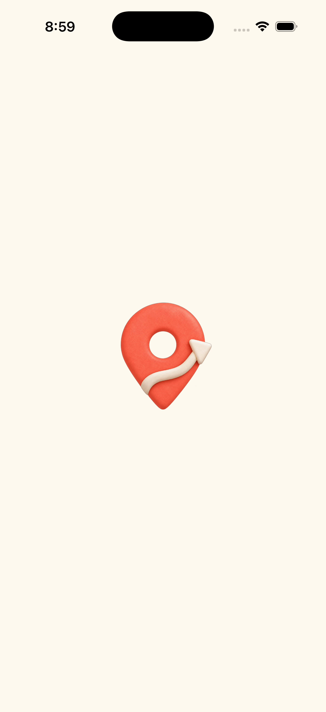
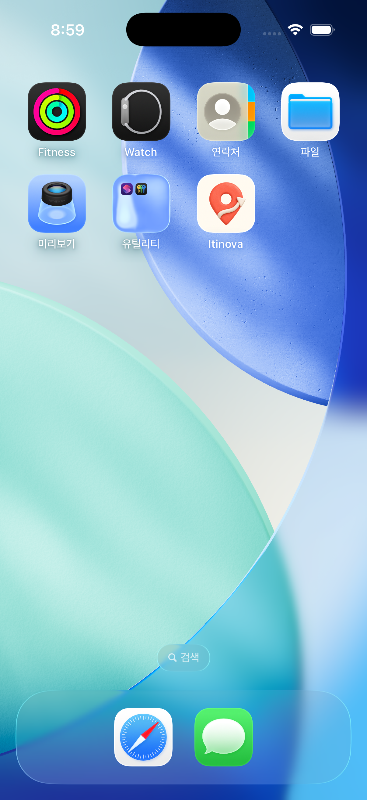
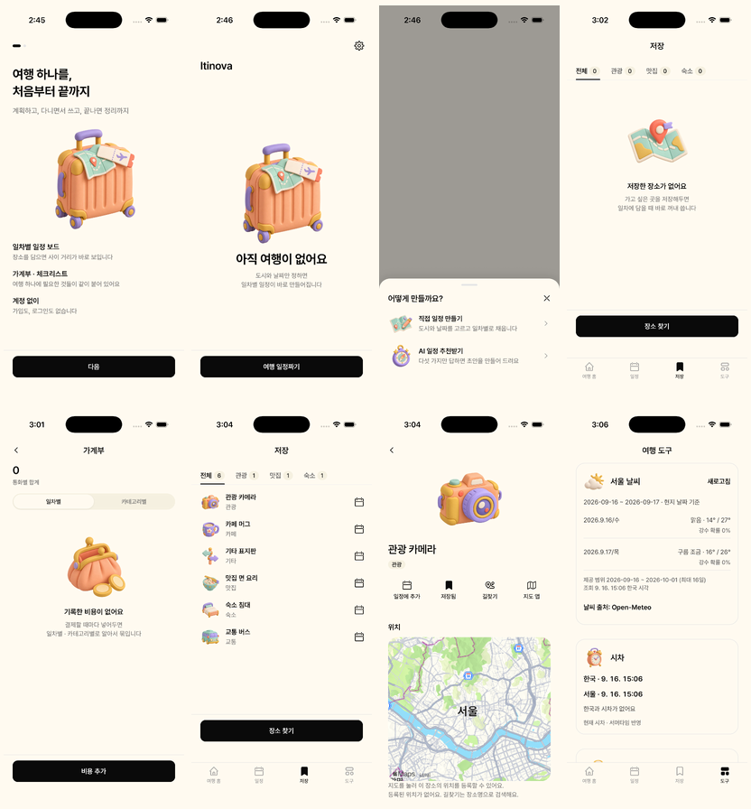
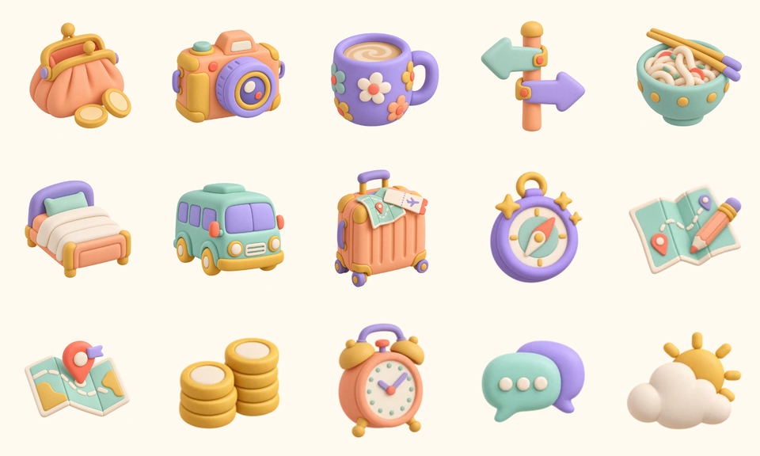

# 클레이 자산·화면 반영

원 플랜: `docs/plans/11-clay-assets-and-visual-refresh.md`. 삭제 직전 HEAD `2fb8f1051c9e25194f078e16b3486040daa077fc`. 실행 기간 2026-09-16~2026-09-17. 사용자 마크 승인·네이티브 재빌드·콜드 스타트 검증을 마쳐 플랜을 완료했다.

## 한 것

- §1–4: 사용자 승인으로 내장 image_gen 사용. hero를 앵커로 선택하고 14종 소품을 같은 원본 참조로 생성했다. 마크는 앵커 재질과 기존 icon-source.svg의 핀·경로 실루엣을 참조했다. 프롬프트와 실제 출력 조건은 [에셋 README](../../assets/clay/README.md)에 남겼다.
- §4: 원본 1254px RGBA를 선형 광에서 축소해 WebP 15개를 생성했다. 720/480/168/144px, q90·alpha100, 총 250,582바이트. 원본·중간 파일은 assets/clay/_src에 git 제외로 보관한다.
- §5: ClayFigure의 정적 require 맵과 categoryFigure를 만들고 9개 화면에 연결했다. 일정의 JoinedRow/Item category 타입은 DB와 같은 Category로 좁혀 문자열 캐스팅 없이 연결했다. O02 그림 자리와 미사용 썸네일 스타일은 제거했다. 홈 제목은 이미 displayLg라 유지했다.
- §5-7/8: 플랜 작성 뒤 도입된 ListRow leading 슬롯과 기존 도구 heading을 그대로 사용했다.
- §5-9: app.json 배경을 크림으로 변경하고, Android 배경색을 덮는 파란 backgroundImage 참조를 제거했다. 2026-09-16 사용자가 최종 마크를 승인해 icon.png·splash-icon.png·android-icon-foreground.png도 교체했다. iOS 아이콘은 1024 RGB, 스플래시는 RGBA, Android foreground는 안전 여백을 추가한 RGBA다.
- §6: 디자인 시스템에 크기 토큰·스타일 계약·보유 목록·생성 레시피, 설계서 14번 결과와 현재 상태, 레퍼런스 결정값을 기록했다. 플랜 10 §6-1은 이미 클레이를 참조하므로 유지했다.

## 안 한 것

- 백업 가져오기 왕복 테스트는 반복하지 않았다. 사진 우선 분기는 QA 전용 DB에 로컬 이미지 photoUrl을 넣어 확인했다.
- Android 실기기 UI 확인은 이번 iOS 검증 범위에 포함하지 않았다.

## 검증 결과

- npx tsc --noEmit: exit 0.
- npm run check: lib/map/travel tools/apple places 모두 통과. 기존 MODULE_TYPELESS_PACKAGE_JSON 경고만 출력.
- git diff --check: exit 0.
- npx expo export --platform ios --output-dir /tmp/itinova-clay-export: 2055 modules, 88 assets, exit 0. WebP 15종 포함, 원본 PNG는 포함되지 않았다.
- 파일 검사: 15개 WebP, 그룹별 목표 크기, 실제 비불투명 알파, 총 용량 2MB 미만 모두 통과. 네이티브 PNG 변형까지 포함하면 1,447,475바이트다. 원본 PNG 16종은 RGBA(불투명 마크 시안 포함).
- rg emptyFigure / s.figure app: 0건. app.json의 1554D1: 0건.
- 별도 iOS 26.0 iPhone 17 Pro 시뮬레이터 `Itinova Clay QA`에서 새 설치 콜드 스타트 → O01 hero → O02 그림 없음 → 빈 홈 → 생성 방식 → 직접 서울 여행 생성 → 가계부/저장함/최근 저장 빈 상태를 확인했다.
- QA 전용 장소 6개를 추가해 S10/S11 44dp 및 S20 160dp 카테고리 6종을 확인했다. 사진 URL이 있는 7번째 장소는 테스트 이미지가 우선 표시됐다. 카테고리 null은 기존 helper의 etc 기본값으로 처리한다.
- 도구 상단 날씨/시차 및 하단 환율/번역의 48dp 아이콘을 확인했다. CUA의 스와이프가 반영되지 않아 하단 스크롤만 Maestro로 실행했다. [E2E] 대상:도구 하단 | 이유:시각 결과 확인 | 결과:PASS(환율 계산 visible).
- 장식 에셋은 접근성 트리에 추가 항목을 만들지 않는다. 크림 배경에서 눈에 띄는 후광·바닥면·글자·인물 없음, 44dp 6종 실루엣 구분 가능.
- 기존 사용자 시뮬레이터 DB는 수정하지 않았다. QA 기기의 데이터도 보존했다. 2026-09-17 재개 시 사용자가 추가한 여행이 있어 QA 기기를 삭제하지 않았다. 기기 ID: `78F26324-A3A7-495B-BEF5-387818CC3A1B`.

- 2026-09-17: expo prebuild --platform ios --no-install → pod install → xcodebuild Debug iphonesimulator 빌드 성공. simctl install/launch로 QA 기기에 설치하고 recordVideo로 콜드 스타트를 캡처했다. 크림 배경 중앙의 새 마크 → 기존 여행을 보존한 홈 진입을 확인했다. 홈 스크린의 새 앱 아이콘도 확인했다. prebuild가 만든 native 폴더는 기존 gitignore 규약대로 커밋하지 않는다.

[카테고리 상세·사진 분기·도구 하단 원본 캡처](2026-09-16-clay-assets/)

## 플랜이 틀렸던 곳

- API 키가 없었고 사용자가 내장 생성 도구를 선택했다. 모델 ID/quality/n을 지정하거나 GPT Image 2.5로 생성했다고 단정할 수 없다. 4장 후보 대신 한 장씩 검토했고 요청 해상도와 달리 모든 결과가 1254px였다.
- 원본을 assets/clay/_src에 두면서 du -sh assets/clay를 2MB 이하로 요구한 검사는 모순이다. 배포 WebP 합계와 export에 포함된 자산을 검사했다.
- 기존 app.json은 Android backgroundImage도 파란 자산을 가리켰다. backgroundColor만 변경하면 파란 배경이 남으므로 해당 참조를 제거했다.
- [Expo Image SDK 57](https://docs.expo.dev/versions/v57.0.0/sdk/image/)의 정적 이미지 source·contentFit·accessible 계약을 확인해 기존 설치본을 사용했다.

## 남은 위험 / 상향 신호

승인한 [최종 마크](2026-09-16-clay-assets/icon-proposal.png)를 반영했다. Android는 실기기 검증 전이다. 작은 카테고리가 실제 기기에서 구분되지 않으면 썸네일만 라벨 배지로 되돌린다.
